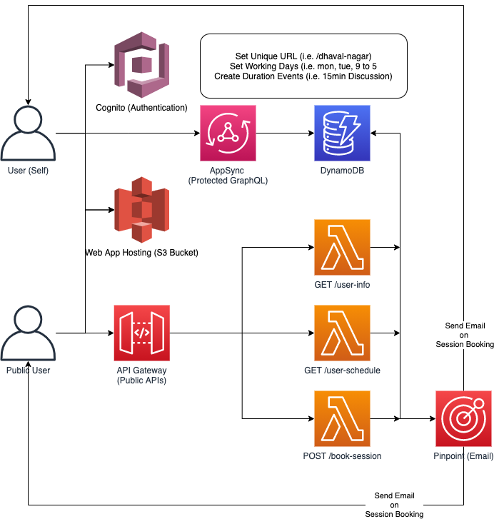

## Create Config file

Copy the `sample.config.json` file and create the `config.<stage>.json` file and set the correct values.

## Lumigo Signup

I am using Lumigo as a monitoring service for this application. They have a Free Tier so you can signup and generate the application token without any additional cost. 

Signup from here - https://lumigo.io/

## Deploy

```
sls deploy --stage <your stage> --region us-east-1
```

## Cognito Signup

Amazon Cognito URL for User Signup
- Replace Stage with your `stage` name
- Replace WEBCLIENTID with your `Cognito Web Client ID`

[https://calendly-app-STAGE.auth.us-east-1.amazoncognito.com/signup?response_type=token&client_id=WEBCLIENTID&redirect_uri=http://localhost:8080](https://calendly-app-STAGE.auth.us-east-1.amazoncognito.com/signup?response_type=token&client_id=WEBCLIENTID&redirect_uri=http://localhost:8080)

## Cognito Signin 

Amazon Cognito URL for User Login
- Replace Stage with your `stage` name
- Replace WEBCLIENTID with your `Cognito Web Client ID`

[https://calendly-app-STAGE.auth.us-east-1.amazoncognito.com/login?response_type=token&client_id=WEBCLIENTID&redirect_uri=http://localhost:8080](https://calendly-app-STAGE.auth.us-east-1.amazoncognito.com/login?response_type=token&client_id=WEBCLIENTID&redirect_uri=http://localhost:8080)

## Clean up

Make sure you empty the S3 Web Hosting bucket first before removing the backend stack.

```
aws s3 rm --recursive <S3 Bucket>
```

Run the `sls remove` to clean up all the deployed resources. 

```
sls remove --stage <your stage> --region us-east-1
```
