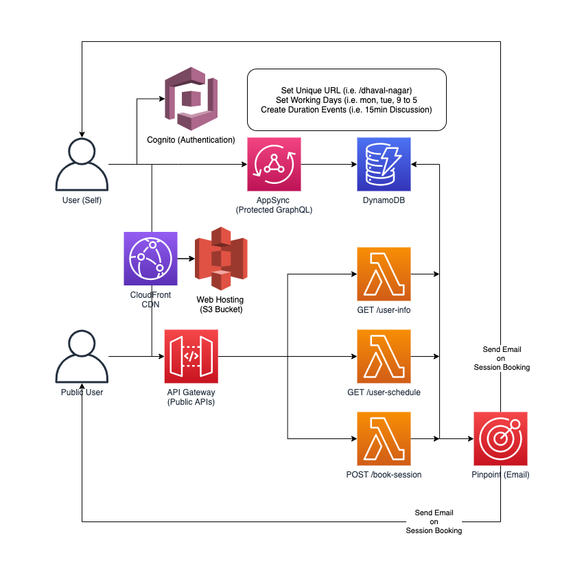

## Create Config file

Copy the `sample.config.json` file and create the `config.<stage>.json` file and set the correct values.

## Deploy

```
sls deploy --stage <your stage> --region us-east-1
```

## Cognito Signup

Amazon Cognito URL for User Signup
- Replace Stage with your `stage` name
- Replace WEBCLIENTID with your `Cognito Web Client ID`

[https://calendly-app-STAGE.auth.us-east-1.amazoncognito.com/signup?response_type=token&client_id=WEBCLIENTID&redirect_uri=http://localhost:8080](https://calendly-app-STAGE.auth.us-east-1.amazoncognito.com/signup?response_type=token&client_id=WEBCLIENTID&redirect_uri=http://localhost:8080)

## Cognito Signin 

Amazon Cognito URL for User Login
- Replace Stage with your `stage` name
- Replace WEBCLIENTID with your `Cognito Web Client ID`

[https://calendly-app-STAGE.auth.us-east-1.amazoncognito.com/login?response_type=token&client_id=WEBCLIENTID&redirect_uri=http://localhost:8080](https://calendly-app-STAGE.auth.us-east-1.amazoncognito.com/login?response_type=token&client_id=WEBCLIENTID&redirect_uri=http://localhost:8080)